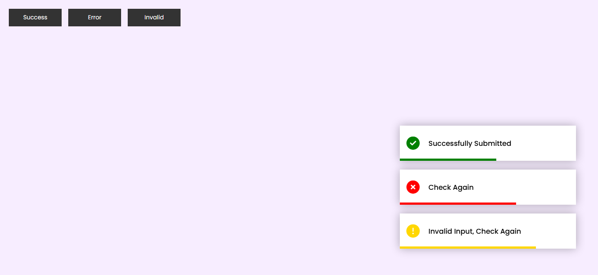
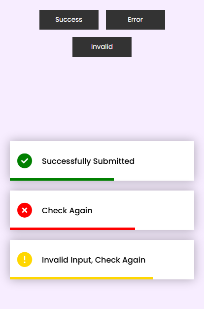

# 🔔 Toast Notifications

This is a small project that implements three different types of notifications:

- **Success** ✅
- **Error** ❌
- **Invalid** ⚠️

## 📌 Features

- Notifications appear on screen when you press the corresponding buttons.
- Each notification has a set duration before automatically disappearing.
- If pressed multiple times, the notifications accumulate and disappear in the order in which they were generated.

## 🚀 Technologies Used

- HTML
- CSS
- JavaScript
- Font Awesome (for notification icons)

## 📸 Screenshots

##### 1. Desktop Display



##### 2. Mobile Display



## 🛠 Installation and Use

1. Clone the repository:

```sh
git clone https://github.com/juanamador1009/toast-notifications
```

2. Make sure to open the `index.html` file on a local server, as the script uses `defer` and may not run correctly if opened directly in the browser. You can use:
   - [VS Code Live Server](https://marketplace.visualstudio.com/items?itemName=ritwickdey.LiveServer)
   - A simple server with Python:
   ```sh
   Python -m http.server 8000
   ```
   Then, open `http://localhost:8000` in your browser.

3. Click the buttons to display the notifications.

---

## 👨‍💻 Author

Created by [Juan Amador](https://github.com/juanamador1009).
